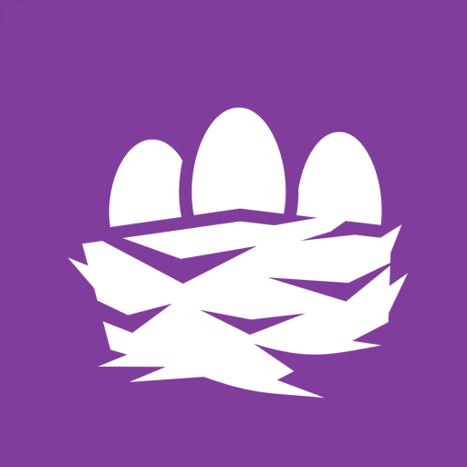

# Nido

 Securely browse nostr web-apps on Android

    

    
<!--      -->
    

- Discussion: https://chachi.chat/groups.0xchat.com/cUbWQToHUMO83DUC

# Getting Started

What is Nostr: https://www.nostr.how

# Features

WIP
